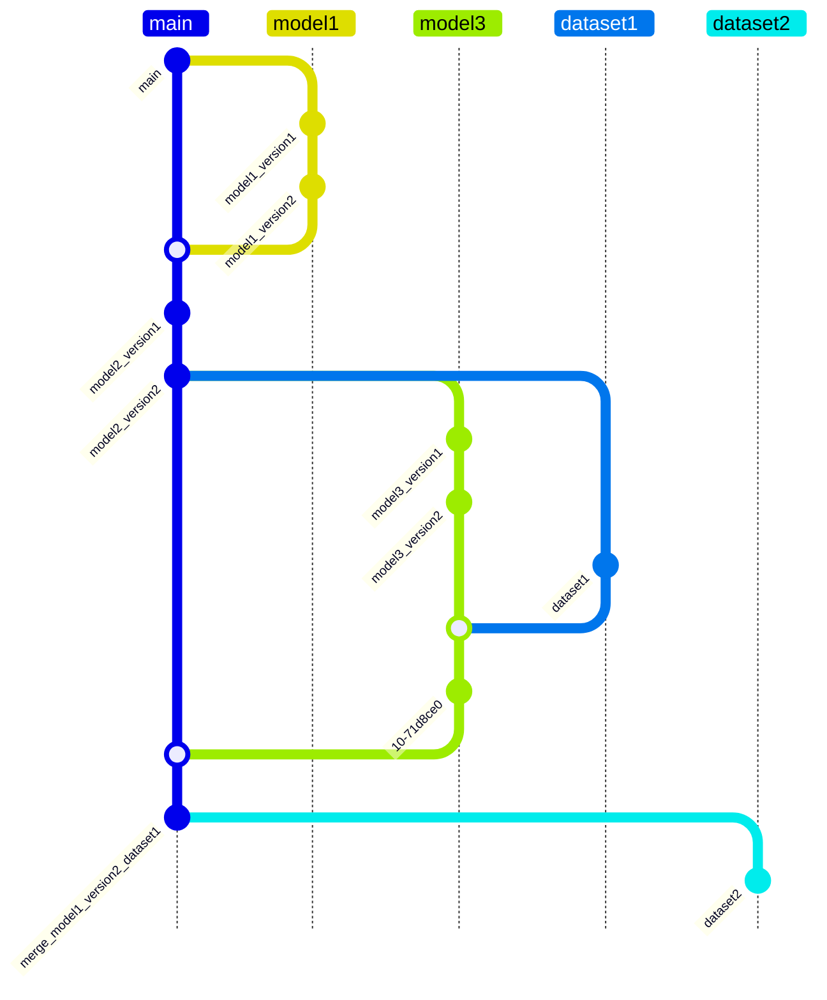
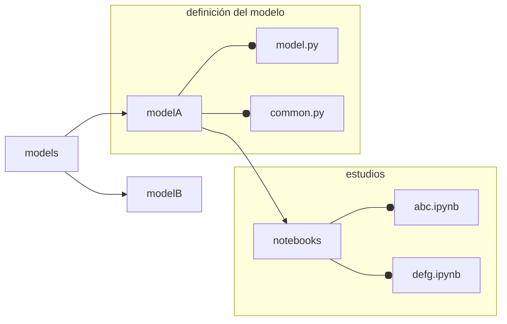
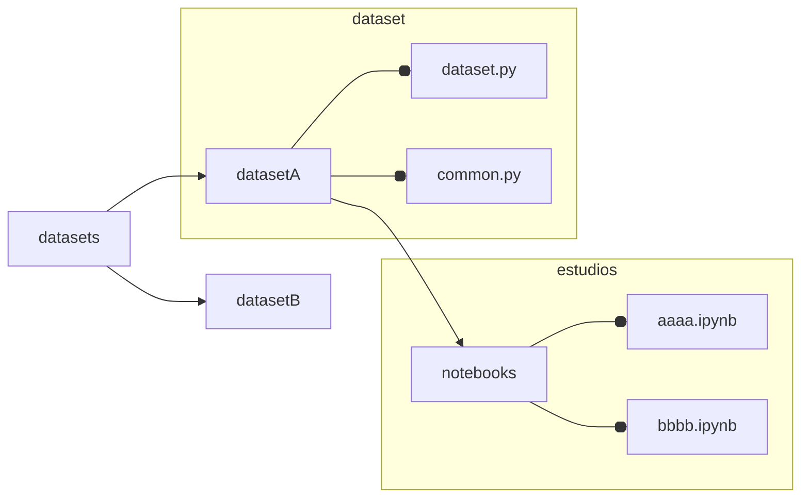
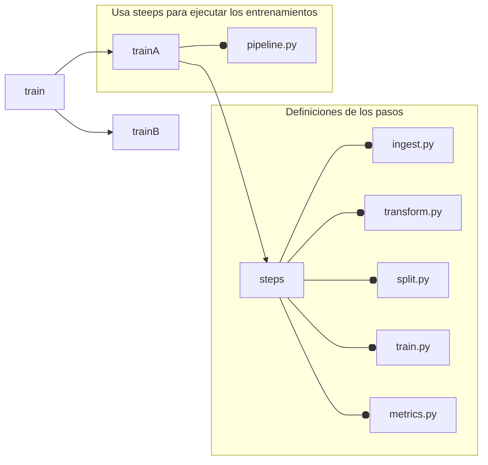
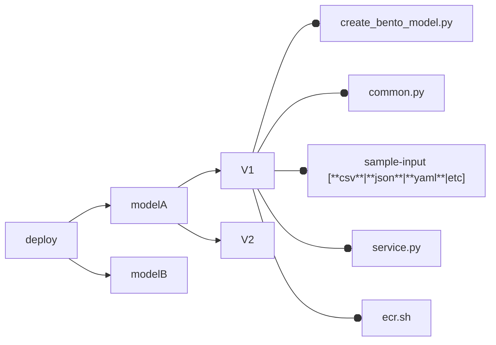

# {{cookiecutter.project_name}}

---

*abstract* : {{cookiecutter.project_description}}

---

# Para los colaboradores

1. Usar **Pipenv** para hacer seguimiento de las dependencias
2. Se usa **Hydra** para gestionar las configuraciones del proyecto.
   a. Cualquier nuevo modelo debe usar estrictamente las
   configuraciones con Hydra b. El colaborador debe preservar el
   esquema de configuraciones y los lineamientos de desarrollo
   explicados mas abajo
3. Los modelos **deben** ser logeados en *mlflow* siguiendo el mismo
   esquema de ramas de modelos explicada abajo a. Si el *pullrequest*
   es de un modelo y no está logeado en *mlflow*, será rechazado b. si
   el *pullrequest* es rechazado pero aun así hay un log en *mlflow*,
   el modelo de *mlflow* debe ser eliminado.
4. Los *deploys* son mediante **BentoML**.
5. Solo el director de desarrollo puede establecer las versiones de
   las dependencias a. Cualquier *pullrequest* que envíe
   modificaciones al Pipfile o/y Pipfile.lock se descartá b. Cualquier
   *pullrequest* que no explique adecuadamente los cambios enviados
   será descartado
6. Este proyecto usa pre-commit, el cual debe ser superado y le
   ayudará para evitar que se descarten sus cambios.
7. Asegurese de que todas las funciones, clases estén correctamente
   escritas, este proyecto usa *pdoc* para crear la documentación este
   soporta **markdown**, **LaTeX** y **mermaid**.
8. Crear los diagramas de clases y flujo (según sea necesario) con
   ***Mermaid***, estos deben ser puestos en la docuemntación de sus
   funcion y/o clases.

---

## Lineamientos de desarrollo

Se definió como base dos ramas de configuración para el desarollo
-**no a nivel de git** si no, de hydra-

* development
* production

Estas son consideradas super-ramas, es decir, son configuraciones
superiores que gobiernan las configuraciones inferiores.

Se define como ramas *inferiores* a aquellas relacionadas con los
*pipelines*.  Un *Pipeline* es aquel lote de configuraciones para
hacer:

* analisis estadisticos
* entrenamientos de modelos
* comprension de modelos
* otros estudios ...

Los **piplines** deben tener nombre de tarea seguido del nombre del
pipline siguiendo el siguiente esquema:

```
<tarea>_<nombre>
```

tarea:

* train   -> reservado
* dataset -> reservado
* estudy  -> reservado
* etc

otro esquema permitido:

```
<modelo&version>-<dataset&version>
```

El cual es util para sobre-entender que este corresponde a un
entrenamiento de un modelo con un dataset particular

---

## Libertades de los colaboradores

Los colaboradores poseen la libertad de escribir pruebas, codigo y
esquetches en los subnodos denominados *notebooks* los cuales se
encuentran aninados en las carpetas
*datasets/<dataset_name>/notebooks* y *models/<model_name>/notebooks*.
En ellos los colaboradores poseen libertad para escribir el codigo que
deseen guardando las buenas practicas establecidas por **PEP8**. La
regla de las dependencias sigue existiendo en este punto, lo que sigue
limitando al colaborador a solicitar al director del proyecto la
integracion de nuevas dependencias.

---

## Esquemas de ramas de GIT

La rama principal **main** es la rama donde convergen las ultimas
versiones de todos los modelos, datasets, entrenamientos y
deployments.  Los otros **branchs** son exclusivos para el desarollo
de cada *pieza* particular.  Los **branchs** de los **branchs** son
para las versiones de cada *pieza*.

Las versiones de los dataset es llevada por *DVC* en la rama main
Todos los archivos de datos raw ya sea los CSV, imagenes y otros no se
les debe hacer seguimiento con git por ningún motivo a excepcion de
casos especificos determinados por el director del proyecto.

En resumen:



---

## Desarrollo de Models

En el sub-modulo models deben ir todos los desarrollos de los modelos
de *inteligencia artificial*, cada modelo debe contenerse en su propia
carpeta con en formato *camellcase* para aquellos casos que sea
necesario.

Entonces la estructura de carpeta de los modelos quedaría de la
siguiente forma:



## Desarrollo de Datasets

El codigo que genera los datasets tambien deben ser puestos en su
propio modulo, siguiendo el siguiente esquema:



Tenga en cuenta que *common.py* y *dataset.py* son estrictos y aunque
*common.py* se encuentre vacio debe existir.

- *common.py* es el lugar correcto para poner las funciones de ayuda
  para el módulo dataset.py.
- *dataset.py* es el lugar donde debe declararse las funciones/clases
  que creen el dataset.

## Desarrollo de Entrenamientos

El entrenamiento de los diversos modelos deben estructurase en la
carpeta *train* destinada a este proceso, esto se debe a que cada
modelo, no necesariamente usa un tipo de dataset especifico, lo que
hace naturalmente que podamos tener diferentes tipos de dataset para
el mismo modelo.  La estructura a seguir es la siguiente



La de definición de los modulos contenidos en *steps* no son estrictas
y pueden variar según corresponda.  Es estricta la definción
*pipeline.py* en la *raiz* del modelo particular con una *función*
llamada *train*

```python
def train(config:DictConfig):
    """
    ...docstring...
    """
    #codigo
    return model
```

El argumento siempre debe ser un config del tipo DictConfig que
provendrá siempre de *Hydra*

## Desarrollo de Deployments

Este modulo, no está pensado para ser ejecutado mediante *pipelines*,
debido a que carece de necesidad, no es una tarea altamente demandante
ni altamente iterativa. La estructura de carpetas y modulos para esta
sub-modulo se lista abajo. Porfavor **NO** usar archivos `__init__.py`
de esta forma *pdoc* no documentará estos modulos de *deployments*, a
no ser que eventualmente sea haga una necesidad.



Como los entrenamientos están logeados en *mlflow* contenerizar
modelos es muy simple con la ayuda de *BentoML*.  Cada tipo de modelo
puede tener *versiones*, estas versiones se corresponden con
*módulos*, estos modulos, contienen todo el codigo necesario para
contenerizar el modelo y disponibilizarlo en -nuestro caso particular-
**ECR**-. Se deja los comandos escritos en bash para hacer esta tarea
de manera automatica sin tener que recordar la cadena de comandos:

```shell
#!/bin/bash

REGION="us-east-1"
AWS_ACCOUNT_ID=$(aws sts get-caller-identity --query Account --output text)
ECR_NAME="<ECR-NAME>"
ECR_TAG="latest"
BACKEND="podman"


# Opciones por linea de comando
while [[ "$#" -gt 0 ]]; do
  case "$1" in
    --backend)
      BACKEND="$2"
      shift 2
      ;;
    --ecr-name)
      ECR_NAME="$2"
      shift 2
      ;;
    *)
      echo "Uso: $0 [--backend <docker|podman>] [--ecr-name <repo> ]"
      exit 1
      ;;
  esac
done

# 0. Registrar el modelo de mlflow en bento
echo "Creando el bento, no olvides prender la VPN ..."
python3 create_bento_model.py
# 1. Construir el Bento y extraer el tag
OUTPUT_BUILD=$(bentoml build 2>&1)
BENTO_FULL_TAG=$(echo "$OUTPUT_BUILD" | grep -oP 'Successfully built Bento\(tag="\K[^"]+')

if [[ -z "$BENTO_FULL_TAG" ]]; then
    echo "Error: Build fallido o tag no detectado"
    exit 1
fi

# 2. Containerizar DIRECTAMENTE con el tag de ECR
ECR_IMAGE_TAG="${AWS_ACCOUNT_ID}.dkr.ecr.${REGION}.amazonaws.com/${ECR_NAME}:${ECR_TAG}"

bentoml containerize "$BENTO_FULL_TAG" \
    --backend "$BACKEND" \
    --image-tag "$ECR_IMAGE_TAG" || {
    echo "Error en containerize"
    exit 1
}

# 3. Autenticación y Push
if [[ "$BACKEND" == "docker" ]]; then
    aws ecr get-login-password --region "$REGION" | \
    docker login --username AWS --password-stdin "${AWS_ACCOUNT_ID}.dkr.ecr.${REGION}.amazonaws.com"
else
    # Para Podman
    aws ecr get-login-password --region "$REGION" | \
    podman login --username AWS --password-stdin "${AWS_ACCOUNT_ID}.dkr.ecr.${REGION}.amazonaws.com"
fi || {
    echo "Error de autenticación"
    exit 1
}

echo "Subiendo imagen a ECR..."
$BACKEND push "$ECR_IMAGE_TAG"

echo "✅ Despliegue exitoso!"
echo "Imagen en ECR: $ECR_IMAGE_TAG"
```

por otro lado, el archivo `create_bento_model.py` deberia lucir algo
como así

```python
import os

import bentoml
import pandas as pd

from common import fun1, fun2

_current_dir = os.path.dirname(os.path.abspath(__file__))
_sample_input_path = os.path.join(_current_dir, "example_input.csv")

_model_uri = "runs:/asdfg12345/model"

bentoml.mlflow.import_model(
    "detector-example",
    model_uri=_model_uri,
    signatures={"predict": {"batchable": False, "batch_dim": 0}},
    custom_objects={
        "fun1": fun1(),
        "fun2": fun2(),
        "sample_input": pd.read_csv(
            _sample_input_path,
        ),
    },
)
"""
Este es el paso donde importamos el modelo de *mlflow* a *bentoml* para su posterior
dockerización
"""
```

Tambien, se deja un ejemplo de como debe lucir el *service.py*
necesario para que bentoml pueda crear la *API* del modelo de manera
automatica

```python
"""Servicio API Example"""

import json
from typing import Annotated, Any, Dict, List

import bentoml
import pandas as pd
from bentoml.models import BentoModel
from pydantic import BaseModel

image = (
    bentoml.images.PythonImage(python_version="3.10", distro="debian")
    .python_packages(
        "pandas",
        "fastapi",
        "pyarrow",
        "arrow",
        "polars",
        "tensorflow",
        "mlflow",
    )
    .run(' * echo "Python packages installed"')
)

custom_objects = bentoml.mlflow.get(
    "example:latest"
).custom_objects
sample_input = custom_objects["sample_input"]
example = json.dumps(sample_input.to_dict(orient="records"))


class InputDataModel(bentoml.IODescriptor):
    """Modelo de datos para la api de Models.

    Args:
      data:
    """

    data: Annotated[
        pd.DataFrame,
        bentoml.validators.DataframeSchema(
            orient="records",
            columns=[
                "col1",
                "col2",
                "col3",
            ],
        ),
    ] = example


class OutputDatamModel(BaseModel):
    """Modelo de datos para la api de Models."""

    prediction: Dict[str, List[str]]


@bentoml.service(image=image)
class EXAMPLEv1:
    """EXAMPLEv1 API service."""

    model = BentoModel("detector-example:latest")

    def __init__(self):
        """
        EXAMPLE API Serive.

        This is the api of EXAMPLE service, this API allow you to predict.

        Args:
          None

        Return:
          None
        """
        self.modelV1 = bentoml.mlflow.load_model(self.model)
        self.x_builder = custom_objects["fun1"]
        self.mesure = custom_objects["fun2"]

    @bentoml.api(
        input_spec=InputDataModel,
        # output_spec=OutputDatamModel,
        route="/predict",
    )
    def predict(self, **params: Any) -> Dict[str, List[str]]:
        """
        Predict.

        Args:
          data: DataFrame

        Returns:
          A Prediction Tuple[pred, Timestamps].
        """
        data = params["data"]
        data = data.convert_dtypes(dtype_backend="pyarrow")
        X, dts = self.fun1(data)
        y = self.model.predict(X)
        prediction = {
            "prediction": [f"{i}" for i in self.fun2(X, y)],
            "timestamp": dts,
        }
        # return OutputDatamModel(prediction=prediction)
        return prediction
```

## Estandar diagrama de flujo clases y fuciones

En e proyecto usaremos el siguiente *estandar* para definir los
diagramas de flujos

1. referencia y nombre de la clase
2. variables e inputs del constructor  `__init__`
3. definición de los metodos, sus variables y su output

Un ejemplo

    ```
    classDiagram
    class DS["DataSetV1"]{
        client ~str~            <- var1
        path ~str~              <- var2
        config ~DictConfig~     <- var3
    
        -__init__(              <- metodo 1
            client~str~,        <- var1
            path~str~,          <- var2
            confi~DictConfig~   <- var3
            ) None              <- retorno
        +creatDS() ~bool~       <- metodo2 retorno
    }
    DS <| -- DictConfig         <- DictConfig es una clase dentro de una clase
    ```

los simbolos `+, -, # y ~` están reservaros para *metodo publico*,
*privado*, *protegido* y interno

**Nota**: Debe agregar en cada commit las modificaciones a al diagrama
para que su commit sea aceptado

---

# Nomenclatura de creacion de tablas

`<model-name>_dataset_<version>`

por ejemplo:

`lstmconv_dataset_v1`

# Requisitos para los pullrequest

En orden de aceptar los pullrequest se asume que usted enteinde las
exigencias anteriores. Las revisiones seran las siguientes:

## models

1. Modelo va acompañado de la descripcion y toda la información
   relevante en su `__init__`.

2. explicaion sencilla del modelo

3. motivación

4. diagrama de flujo escrito en **Mermaid**

5. código completamente documentado (**con su propio docstring
   también**)

6. si el *pullrequest* es un cambio al modelo ya existente, debe
   agregar una campo nuevo que llamado `#cambios` en el `__init__`,
   indicando el cambio. Si el cambio es estructural, haga todas las
   modificaciones necesarias en los puntos anteriores.

> [!WARNING]
> **Debió pasar el pre-commit**

---

# inicializando el proyecto

```shell
# dependencias
pipx install pre-commit pipenv
```

```shell
# dentro de la carpeta del proyecto
pipenv install # instalas las dependencias del proyecto
               # y puede tomar algo de tiempo

pipenv shell   # inicializa el entorno python

# installa los git hooks
pre-commit install
```

# Creación de la documentación de código

para la creación de la documentación es necesario hacer

```shell
# Siempre desde la razi del repositorio
make docs
```

---
